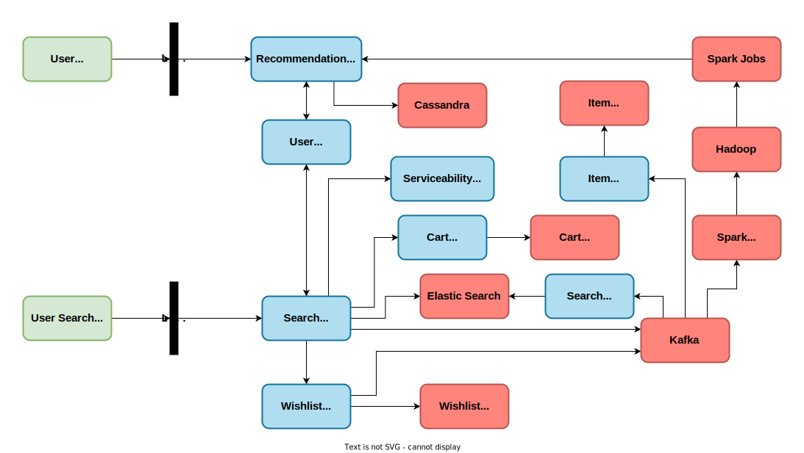

# Step 1: Requirements Clarifications

### 1. Functional requirements
1. Should provide a search functionality with delivery ETA
2. Should provide a catalog of all products
3. Should provide Cart and Wishlist features 
4. Should handle payment flow smoothly
5. Should provide a view for all previous orders

### 2. Non-functional requirements
1. Low Latency
2. High Availability
3. High Consistency
 
Meeting all three non-functional requirements for such a huge system is difficult. But not everything needs to be always available, have low latency and be extremely consistent. For example: payment and inventory systems should be highly consistent even at the cost of availability. Search needs to be highly available even if it's slightly inconsistent. Most user facing components should have a low enough latency.

### 3. Who will be using the system ?
### 4. How will they be using it ?
### 5. How many users are there ?
### 6. What does the system do ?
### 7. What are the inputs and outputs of the system ?
### 8. How much data is expected to be handled ?
### 9. How many requests per second are expected ?
### 10. What is the expected read-to-write ratio ?

# Step 2: Back-of-the-envelope estimation

### 1. Read-to-write ratio
### 2. Number of concurrent requests
### 3. Number of monthly users
### 4. Number of daily active users 
### 5. Required storage capacity
### 6. Bandwidth requirements

# Step 3: Create a high-level design

### Amazon HLD

The system is divided into two parts: Home & Search view and Purchase & Checkout flow. There will be two UIs that we will offer, a home screen which will have some recommendations, personalized or general depending on if it is a returning user or a new user and a search page where users can see results based on some search text

### Home & Search flow

### Purchase & Checkout flow

# Step 4: Database design

### 1. Define how data will be processed
### 2. Define how data will flow through the system
### 3. Determine which database will be the best fit in this case

We will use an ElasticSearch here as it is very efficient for text-based search and also supports fuzzy search which we need for seamless user experience

# Step 5: Design core components

### Present various approaches, benefits & drawbacks of each option and justify your approach

### Inbound Services
Inbound services will contain all the services that will interact with supplier systems and fetch relevant data. When a new supplier is added or a supplier adds a new item to their inventory, it needs to flow into the system, so that this information is easily available to the user. This information will reach the user on their homepage or through search results through various consumers listening to a Kafka which will receive events from Inbound services anytime such changes happen. In other words, whenever a new item is added by the supplier, this information is captured by the Inbound services and then it is streamed to Kafka and this information is sent to end-users via various consumers listening to Kafka on their homepage or search results' page.

### Item Service
One of the consumers in the system is Item service that will listen to kafka to onboard new items and will expose APIs to add, update and fetch items. It sits on a MongoDB because the items data will be unstructured. For ex: a shirt will have attributes like size, color while a TV will have attributes like resolution, RAM, etc.

### Search Consumer
The Search consumer makes sure that whenever a new item is onboarded, it can be queried by the users. It will read and process all the new items being onboarded and format it such that they can be stored into the database and the search system can understand it. After formatting, the search consumer will put this data in an ElasticSearch database.

### Search Service
The Search service interacts with ElasticSearch and it exposes APIs to filter, sort, search the products. 

### Serviceability and TAT Service
One of the additional functional requirement could be that the search should not show results that cannot be delivered to the user as it would be a poor user experience. For this, the search service will talk to Serviceability and TAT Service. Serviceability and TAT service will check which warehouse the product will be delivered from, if there is a route between the warehouse and the user's PIN code, if yes then can that route be used to carry this product. It will also figure out an approximate delivery date and communicate all this information to the search service. The search service will further communicate this information to the user.

### Wishlist and Cart Service
From the search screen, the user should be able to wishlist a product or add it to cart. This happens via Wishlist Service and Cart Service. Both these services will be built in the same way, in that they each provide APIs to fetch, update, add to and delete items from a Wishlist or Cart and they both sit on MySQL DBs. They can be built on the same hardware but considering that wishlists tend to be very long, especially when a sale might be approaching, it is suggested to have separate hardware for these services. This way scaling the hardware for individual service becomes much easier.

### Kafka
Each time a search happens, an event is fed to Kafka. This helps us build a recommendation system personalized to the user's interests and also a general recommendation based on the most popular products. Similarly, Wishlist and Cart services will also send similar events to Kafka. 

### Recommendation Services
The Kafka service will be connected to a Spark streaming consumer which will generate real-time reports like which are the most sought after products in the last one hour or day, most wishlisted item, locations from where most orders are coming, highest revenue-generating categories, etc. All this data coming from Kafka will also be dumped in a Hadoop cluster on which some standard algorithms like ALS can be run to identify the next set of products a user might need to buy based on their past purchases, based on which we can generate personalized recommendations for them. It will also tell us about the products other similar users have searched, wishlisted or brought, which we can add to the recommendations for this user. Once we have these recommendations, a spark cluster will talk to a recommendation service, which is a repo of all recommendations in our system, whether they are general recommendations against a user id or based on a category of products. This way the users will see general recommendations on their homepage but if they are going through a certain category of products, the recommendations will be filtered out.

### User Service
User service is the repo of all users and also provides APIs to fetch, update, add and delete users from our system. It sits on a MySQL DB and maintains a Redis cache. So, let's say our search service wants to fetch a user's PIN code to communicate to the serviceability service, user service will first check in the Redis, if Redis doesn't have the information, it will lookup in the MySQL DB, get the user's info, store it in Redis for further use and return it to the search service

### Logistic Service & Warehouse Service
Serviceability and TAT service identifies whether or not we can deliver to a location and calculates the ETA and it does so with the help of Logistic and Warehouse service. Serviceability service can access the Warehouse service to get a repo of all products stored in a warehouse and it can talk to logistic service to find out all the courier partners or to fetch a list of PIN codes that we can service. Based on all this information, Serviceability and TAT service will come up with the shortest route between the warehouse housing the product and the user, and will also compute the ETA for delivery. None of these calculations will happen at runtime, everything will be pre-computed and cached so that we can instantaneously give an ETA to the users. 

### Order Taking Service
When a user wants to place an order, the request will go to an Order taking service, which is a part of a larger Order Management System. The Order Management System sits on a MySQL DB. We have multiple tables like customer table, item table, order table, etc. and a lot of transactions going on across these tables. Now we don't want two users to be able to order the last piece of an item, just because our database couldn't reflect the change promptly enough. This means we need ACID properties of relational DBs, hence MySQL.

### Inventory Service
As soon as the Order taking service is called, a record is created in Redis with an order id, date and time at which the order was created and an expiry time for the order id. Along with these details, there will also be a status against that order id, which will initially be "created". Now the next step will be to call the inventory service, if there were 5 units of the product before the order was created, after creating the order, the inventory count for the product will be reduced to 4, only after this the user will be redirected for payments. But why do we update the inventory before the payment is completed? Let's say we had only 1 unit of product left in the inventory and 3 people trying to buy it, in this case, if we reduce the inventory count before going to the payment flow, 2 out of the 3 buyers will see that the item is already out of stock and their flow will end before even going to the payments page.

### Payment Service
Once the inventory is successfully updated, the order taking service will talk to the payment service, which will talk to the payment gateway and carry out the whole payment flow. Now there can be three possible outcomes from this payment flow: success response, failure response, no response. 
1. Success response: Let's say order was placed at 10:01 with expiry time as 10:05 and at 10:03 we got payment success response. In this case, we will update the order status to "placed" and an event will be fired to Kafka saying that an order is palced against this product with the details.
2. Failure response: Before starting the payment flow, we have already updated the inventory. This means as far as inventory system is concerned the order has already been placed, and now that the payment is failed, we need to cancel this order. This means that the order status will be updated to "cancelled". Since the order is cancelled, we need to revert the count in the inventory database, so we will again talk to the inventory service. On top of this order taking system and inventory system, we will have a reconciliation system that ensures that orders count and inventory count are in sync and not inconsistent with each other. 
3. No response: This can happen when a user initiated the payment but without completing it, closed the browser, in this case there will be no response from the payment service. This means that we still have that item in our stock but it's not reflected in the inventory system. Now, this is where the Redis comes in. At 10:05, the Redis record for the order will get expired and will implement the expiry callback. At this point, the order taking service will talk to the payment service to time out the payment and mark it as failed. From here out, the flow will be the same as that in case of a failed payment case, the order will be cancelled and inventory count will be rolled back. Now there is a potential race condition here, what if the payment success and order expiry happens around the same time? The most common case would be payment success followed by order id expiry. In this case, to skip the expiry event, we can delete the record from Redis as soon as the payment success response is received. A problematic case would be if the payment success followed the expiry event. Our order expires at 10:05, say the payment success comes in at 10:07, but by then the order will already be cancelled. So we can either refund the money to the customer and let them know that due to some reason, their order cannot be placed or we can place the order from our end, mark the parent as complete and update the status to "placed"

### Further 
As soon as we get the response from the payment system, we will put an event in Kafka. Suppose we sold the last unit of a product, to make sure no user try to order it, we should remove it from the search results. As soon as the item goes out of stock, Search consumer will remove the item from the Search listing. Now our system is pretty consistent, does not show products that cannot or should not be ordered, handles the payment flow smoothly, supports search, provides personalized recommendations, etc. 

### Bottleneck
The bottleneck is the MySQL DB used in the order management system. A company like Amazon will receive millions of requests every day and orders data will be saved for at least a few years for audit purposes. This means the order management system database will be MASSIVE. But we need ACID properties to maintain consistency, that was the whole point of using MySQL. But do we need to keep even the delivered or canceled orders in MySQL? They are already in the terminal state and will not affect other orders. So when an order reaches a terminal state like delivered or canceled, we will move it out to a Cassandra and this will be implemented with the help of order processing service and historical order service. 

### Order Processing Service, Historical Order Service, Archival Service
Order processing service and Historical order service are again a part of the larger order management system. Order processing service will take care of the order lifecycle i.e. whatever changes happen to the order after placing, like fetching order details for tracking or fetching orders by status, etc will go through this service. Historical order service will provide APIs to fetch details of delivered or canceled orders. An archival service will query the order processing service to fetch all orders with terminal status and then talk to historical service to insert them in Cassandra. Once this Cassandra write is done it will again talk to the order processing service to delete these completed orders from the MySQL database.

### Why Cassandra ?
The thing about the orders database is that even though the data is massive, there will be a fixed variety of queries that we will run on it like fetching orders by id or status or created date or category, etc i.e. large data with finite queries. This is the perfect use case for Cassandra.

### Orders View
Now that the users can successfully place their orders in our system, they might want to see their past orders as well. This is where the Orders View comes in. There will be an intermediate service that will talk to the order processing service and historical service to fetch all ongoing as well as completed orders and communicate to the orders view.

### Notification Service
Whenever an order is placed or the status changes to “in transit” or “delivered”, either the seller or the customer needs to be notified and this happens through the notification service.

# Step 6: Scale the design

### Discuss: Load Balancing, Horizontal Scaling, Caching, Database Sharding, Replication

# Step 7: Identifying and resolving bottlenecks

### 1. Is there any single point of failure in the system? What steps can be taken to mitigate this risk?
### 2. Are there enough replicas of data to ensure that users can still be served if a few servers are down?
### 3. Are there enough copies of different services running to ensure that a few failures will not cause a total system shutdown?
### 4. How is the performance of the service being monitored? Are there alerts in place to notify the team when critical components fail or their performance degrades? 